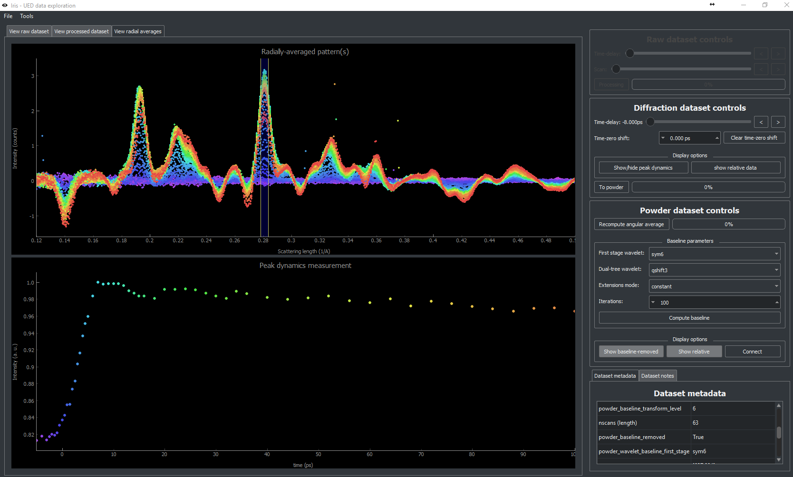

Iris - Ultrafast Electron Scattering Data Exploration
======================================================

.. image:: https://dev.azure.com/laurentdecotret/iris-ued/_apis/build/status/LaurentRDC.iris-ued?branchName=master
    :target: https://dev.azure.com/laurentdecotret/iris-ued/_build/latest?definitionId=3&branchName=master
    :alt: Azure Pipelines Build Status
.. image:: https://readthedocs.org/projects/iris-ued/badge/?version=master
    :target: http://iris-ued.readthedocs.io/
    :alt: Documentation Build Status
.. image:: https://img.shields.io/pypi/v/iris-ued.svg
    :target: https://pypi.python.org/pypi/iris-ued
    :alt: PyPI Version
.. image:: https://img.shields.io/conda/vn/conda-forge/iris-ued.svg
    :target: https://anaconda.org/conda-forge/iris-ued
    :alt: Conda-forge Version
.. image:: https://img.shields.io/pypi/pyversions/iris-ued.svg
    :alt: Supported Python Versions

.. contents::
   :depth: 2
..

Iris is both a library for interacting with ultrafast electron diffraction data, as well as a GUI frontend
for interactively exploring this data.

Iris also includes a plug-in manager so that you can explore your data.

    Two instances of the iris GUI showing data exploration for ultrafast electron diffraction of single crystals and polycrystals.

Installation
------------

**Starting with iris 5.1.0, Windows standalone installers are now available!**. This will install `iris` as a standalone program, 
completely independent from other Python installations on your system. This way should be preferred for those who do not need to interact
with data outside of `iris`. Standalone installers are available on the `releases <https://github.com/LaurentRDC/iris-ued/releases/>`_ page.

To interact with `iris` datasets from a Python environment, the `iris-ued` package must be installed. `iris` is available on PyPI; 
it can be installed with `pip <https://pip.pypa.io>`_.::

    python -m pip install iris-ued

`iris` is also available on the conda-forge channel::

    conda config --add channels conda-forge
    conda install iris-ued

To install the latest development version from `Github <https://github.com/LaurentRDC/iris-ued>`_::

    python -m pip install git+git://github.com/LaurentRDC/iris-ued.git

Each version is tested against Python 3.6+. If you are using a different version, tests can be run
using the standard library's `unittest` module.

Usage
-----

Once installed, the package can be imported as :code:`iris`. 

The GUI component can be launched from a command line interpreter as :code:`python -m iris`
or :code:`pythonw -m iris` (no console window).

Test Data
---------

Test datasets are made available on the Siwick research group public data server, which can be 
`accessed anonymously here <http://www.physics.mcgill.ca/siwicklab/publications.html>`_.

Documentation
-------------

The `Documentation on readthedocs.io <https://iris-ued.readthedocs.io>`_ provides API-level documentation, as 
well as tutorials.

Citations
---------

If you find this software useful, please consider citing the following publications:

.. [#] L. P. René de Cotret, M. R. Otto, M. J. Stern. and B. J. Siwick, *An open-source software ecosystem for the interactive 
       exploration of ultrafast electron scattering data*, Advanced Structural and Chemical Imaging 4:11 (2018) DOI: 10.1186/s40679-018-0060-y

.. [#] L. P. René de Cotret and B. J. Siwick, *A general method for baseline-removal in ultrafast 
       electron powder diffraction data using the dual-tree complex wavelet transform*, Struct. Dyn. 4 (2017) DOI: 10.1063/1.4972518.

Support / Report Issues
-----------------------

All support requests and issue reports should be
`filed on Github as an issue <https://github.com/LaurentRDC/iris-ued/issues>`_.

License
-------

iris is made available under the MIT License. For more details, see `LICENSE.txt <https://github.com/LaurentRDC/iris-ued/blob/master/LICENSE.txt>`_.
