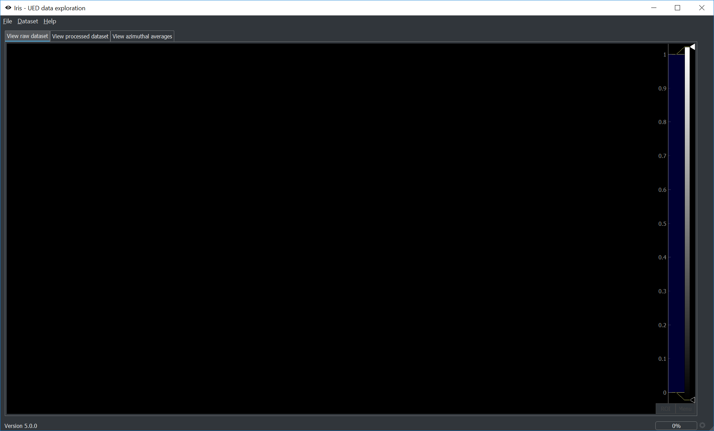
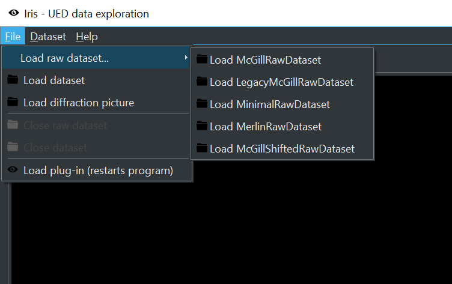
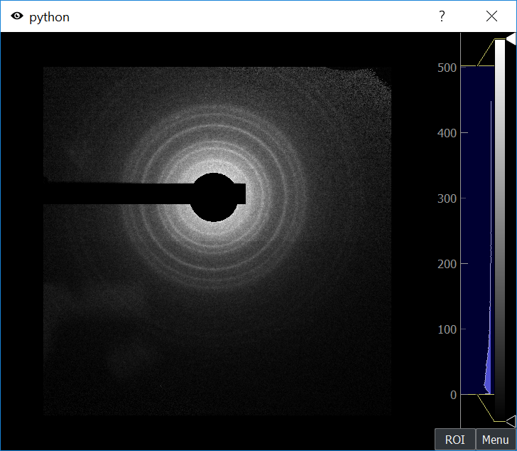
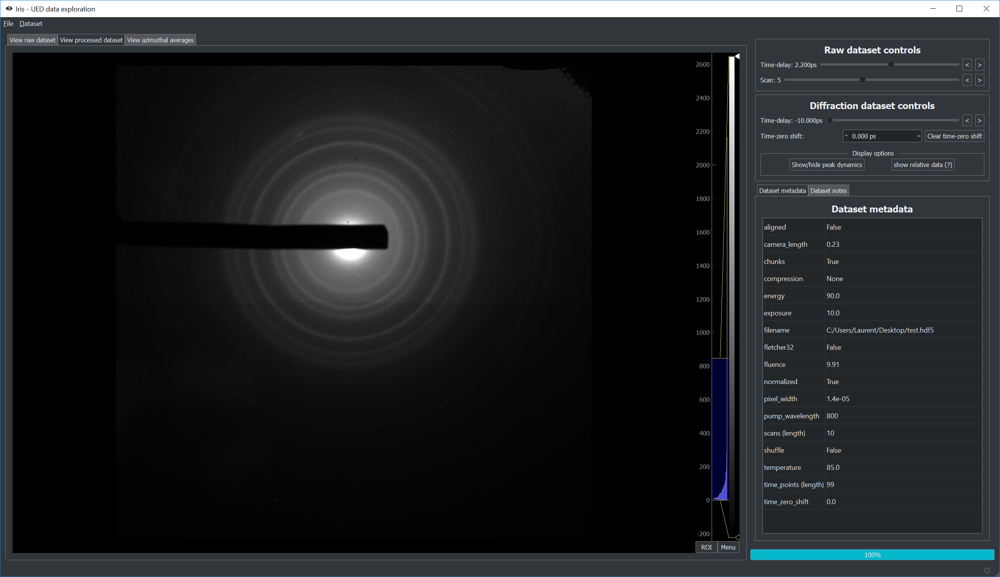
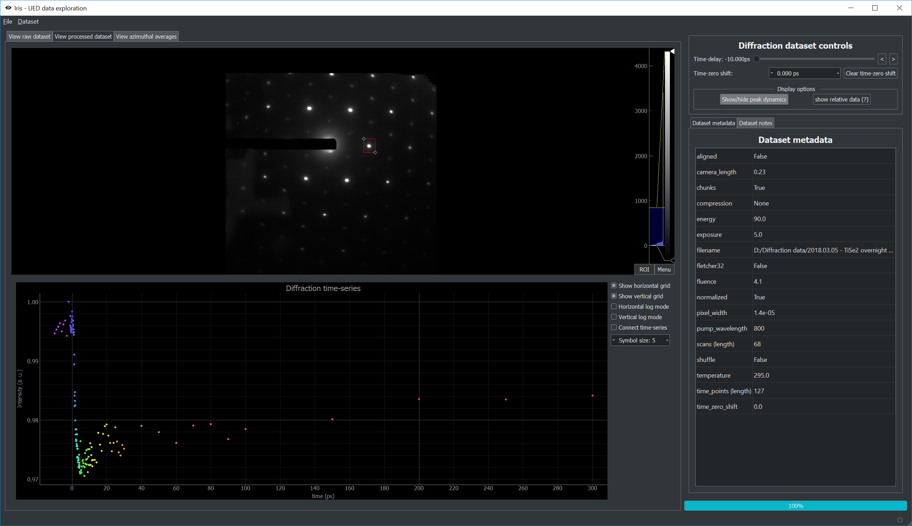
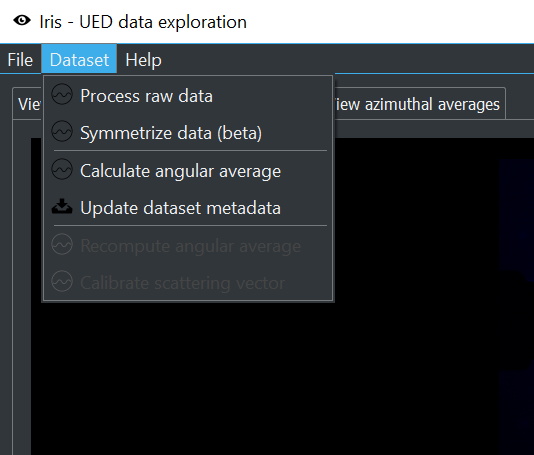
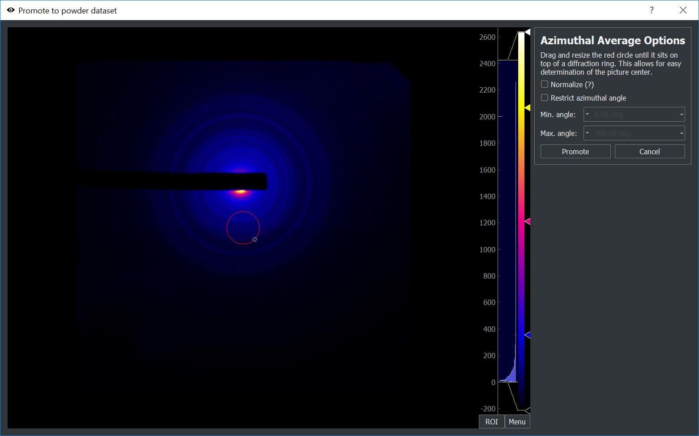
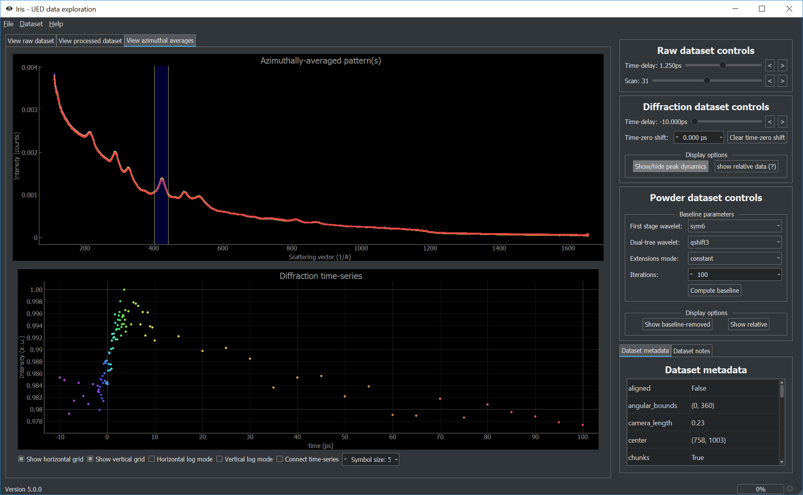
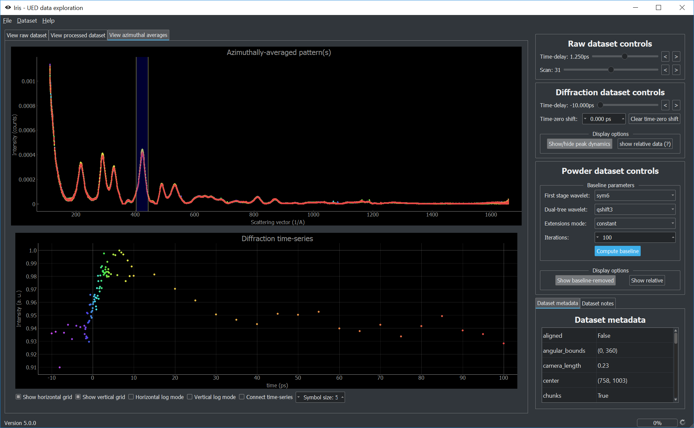
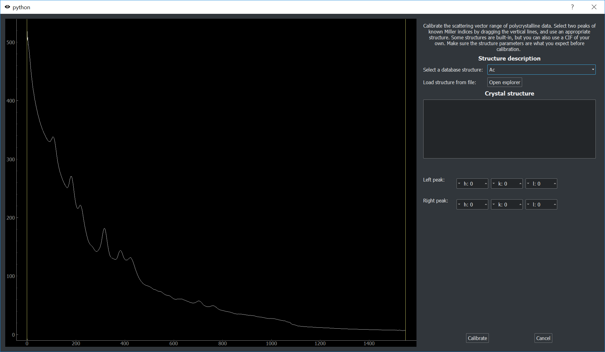

.. include:: references.txt

.. _workflow:

*******************************
Using the GUI: typical workflow
*******************************

Startup
-------

To start the GUI from the command line::

    python -m iris

The first screen is shown below.

Loading raw data
----------------
The file menu can be used to load raw data. Depending on the installed plugins, options will be available. To install 
a new plug-in, use the following option:

.. image:: images/load_plugin_option.png
    :scale: 50 %
    :align: center

You'll be able to select a plug-in file which will be copied to the plug-in directory. The program will then restart.
Once a plug-in is installed, a new raw data format will appear.

Here is an example of loaded raw data: Raw data controls are available to the right.

.. image:: images/raw_data.png
    :align: center

Data reduction
--------------

Once raw data is loaded, the following option becomes available:

.. image:: images/reduction_dialog.png
    :scale: 50 %
    :align: center

This opens the data reduction dialog.

.. image:: images/reduction_window.png
    :scale: 75 %
    :align: center

Parts of the data can be masked. To add a mask, use the controls on the top of the dialog. Masks can be moved and resized. 
Note that all images will be masked, so this is best for beam blocks, known hot pixels, etc. 

.. image:: images/reduction_mask.png
    :scale: 75 %
    :align: center

A preview of the mask can be generated:

Once you are satisfied with the processing parameters, the 'Launch processing' button will open a file dialog so that 
you can choose where to save the reduced HDF5 file. Processing might take a few minutes.

Data exploration
----------------

Once processing is complete, the resulting diffraction dataset will be loaded. New controls will be available. 

The 'Show/hide peak dynamics' button can be toggled. Doing so allows for the exploration of the time-evolution of the data.

When a diffraction dataset is loaded, new options become available.

One of these options, 'Compute angular averages', is best suited for polycrystalline diffraction. It opens the following dialog:

Drag and resize the red circle so it coincides with a diffraction ring. This will allow for the determination of the diffraction center. 
The averaging will happen after clicking 'Promote'. This might take a few minutes.

Polycrystalline data exploration
--------------------------------

After the azimuthal averages have been computed, a new section of the GUI will be made available, with additional controls.

.. image:: images/poly_view.png
    :align: center

The top screen shows the superposition of all radial profiles. Dragging the yellow lines allows for exploration of time-evolution 
on the bottom screen. Note that the trace colors on the top are associated with the time-points and colors of the bottom image.

The baseline can be removed using the controls on the right. You can play with the baseline parameters and compute a baseline many times 
without any problems.

Polycrystalline scattering vector calibration
---------------------------------------------

On the above images, the scattering vector range might not be right. To calibrate the scattering vector range
based on a known structure, select the 'Calibrate scattering vector' option from the 'Dataset' menu.

.. image:: images/calibrate_option.png
    :scale: 50 %
    :align: center

This opens the calibration dialog.

You must either select a structure file (CIF) or one of the built-in structures. Once a structure is selected, it's description 
will be printed on the screen. Make sure this is the crystal structure you expect.

Then, drag the left and right yellow bars on two diffraction peaks with known Miller indices. Click 'Calibrate' to calibrate the 
scattering vector range.

.. image:: images/calibration_dialog_2.png
    :scale: 75 %
    :align: center